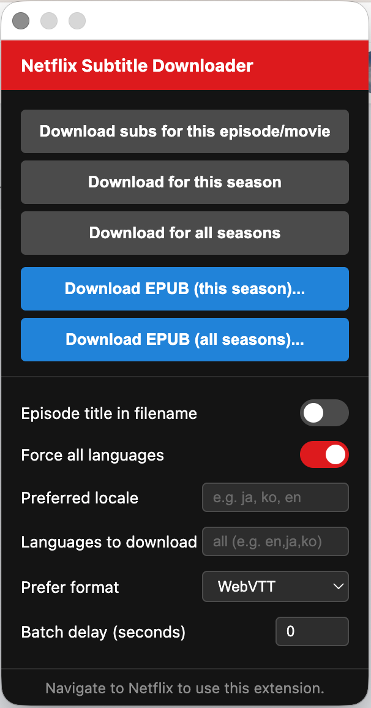

# Netflix & Disney+ Subtitle Downloader

A Chrome extension (Manifest V3) that downloads subtitles from Netflix and Disney+ as ZIP or EPUB files with dual-language support.

Based on the [Netflix subtitle downloader](https://greasyfork.org/en/scripts/26654-netflix-subtitle-downloader) userscript by tithen-firion, rewritten as a standalone Chrome extension with no Tampermonkey dependency.

Disney+ playlist discovery and subtitle handling are adapted from the MIT-licensed `disneyplus.js` userscript supplied for this change.

## Features

- **Netflix ZIP downloads** — WebVTT or DFXP format for current episode, season, or all seasons
- **Download as EPUB** — Merge subtitles into an EPUB ebook with dual-language support
  - Main language displayed in normal size
  - Secondary language in smaller gray text below
  - Closed captions `[CC]` styled at reduced size
  - Paragraph breaks for dialogue gaps > 5 seconds
  - Table of Contents with per-episode chapters
- **Netflix batch download** — Automatically navigates through episodes to collect all subtitles
- **Language filtering** — Choose which languages to download
- **Force all languages** — Make Netflix show subtitle tracks for all available languages
- **Preferred locale** — Set a preferred subtitle locale
- **Disney+** — Download the current video's subtitles, or all episodes across a series, as an SRT ZIP or EPUB

## Screenshot

## Install

1. Download or clone this repository
2. Open `chrome://extensions` in Chrome
3. Enable **Developer mode** (toggle in top right)
4. Click **Load unpacked** and select the `NetflixSubtitleDownloader` folder

## Usage

1. Navigate to Netflix or Disney+ and play a show or movie
2. A menu appears at the top of the page with download options. On Netflix:
   - **Download subs** — Download subtitle files as a ZIP
   - **Download EPUB (this season)** — Generate an EPUB for the current season
   - **Download EPUB (all seasons)** — Generate an EPUB for the entire series
3. For EPUB, a dialog lets you pick the main and optional secondary language
4. Settings are available in the extension popup (click the extension icon)

On Disney+, open a series page (for example, a `/zh-hant/browse/entity-...` URL) to download a whole-series subtitle ZIP. For an EPUB, play an episode first and choose **Download EPUB (whole series)**. Its language dropdowns show the subtitle tracks found in that episode. The extension identifies the series from the current episode, visits each episode's player to collect subtitles, then closes playback and waits 5 seconds before the next episode. Keep the tab open while it works; **Stop and save** produces a partial download. If Disney+ blocks playback, the batch waits on that episode and offers to save the episodes already collected. The language filter applies to ZIP downloads. Subtitle availability can vary by episode. The EPUB dialog also lets you choose a cover from images on the page, upload one, or use no cover. Netflix's format preference, forced language setting, and preferred locale apply only to Netflix.

## Settings (via popup)

| Setting | Description |
|---------|-------------|
| Episode title in filename | Include episode title in downloaded filenames |
| Force all languages | Make Netflix expose all available subtitle tracks |
| Preferred locale | Set a preferred subtitle language (e.g. `ja`, `ko`, `en`) |
| Languages to download | Comma-separated filter (e.g. `en,ja,zh-Hant`) |
| Prefer format | WebVTT or DFXP/XML |
| Batch delay | Delay between page navigations during batch downloads |

## License

MIT
